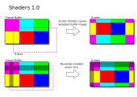

## Tile Renderer

This is a small tile-based rendering project to learn a bit more about
[OpenGL](https://www.khronos.org/opengl/) and brush up on [C++](https://isocpp.org/).

#### Build Requirements

[GLFW](https://www.glfw.org/) 3.3.2 and [GLAD](https://glad.dav1d.de/#profile=core&language=c&specification=gl&loader=on&api=gl%3D3.3)
0.1.34 are required for the OpenGL API.

#### Rendering

Tiles are rendered in two stages. The first stage takes a world position and uses this to lookup which tile to
render from an index buffer. The second stage copies the framebuffer to screen, along with an offset to correct
for discontinuities.

The framebuffer is not cleared between frames and the tile shader "wraps" when the input coordinates exceed the 
buffer edges. Only pixels that are no longer within frame are overwritten and replaced with those that have
been newly exposed.

The screen shader then simply copies the buffer contents to screen, and applies an offset to align the rendered 
image correctly.

#### Notes

This project is mainly an exercise to dig around in OpenGL a bit, so some design decisions are more to try out
some feature or another. For example, there's no compelling reason to only render parts of the screen other than
that it's a good opportunity to get creative with the shader pipeline.
Other things to note are:

1. Input controls are unconstrained and can go out of bounds. This generates artifacts.
2. The Framebuffer may be smaller than the screen, so the final image will be scaled. As there is no
filtering, this can produce aliasing for screen sizes that are not integer multiples of the framebuffer.
3. STL array objects and template functions have been used to pass buffer data between classes and reduce the
use of void pointers to library calls. I personally feel this is overkill for this particular application, as
it adds complexity without solving any significant issue. Data is currently passed directly into OpenGL
buffers, which are type agnostic and need to be set up manually anyway.
